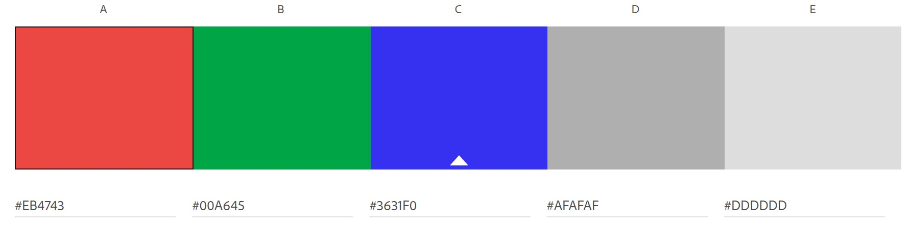

# My About Me

James Clark

 

The main purposes of the About Me project was to get into HTML and CSS coding and is one of my first attempts at creating a website from scratch. I started off by learning how to add images, changing the color of the background and text, and stylizing text by adding tags. Later, I learned how to make site responsive to different sized screens, embedded a video, create a contact form, and finally, add a nav bar. VSCode is the main program that I used to create the site. It was also my first time-using GitHub and Netlify, which is where my webpage is hosted.

When picking the color scheme for the site, I kept in mind that some people may not be able to make out the text if the background a similar color (especially for those who are color blind). Also, if I were to make the page too colorful (like if I where use light blue for the background and red or purple for the text) it would look unprofessional. Then I thought if I were to make the background light gray and text blue it be easy for anyone to read whether if you colorblind or not and would look more professional.

Citations:
https://www.w3schools.com, https://color.adobe.com, http://fonts.google.com

©2022 James Clark